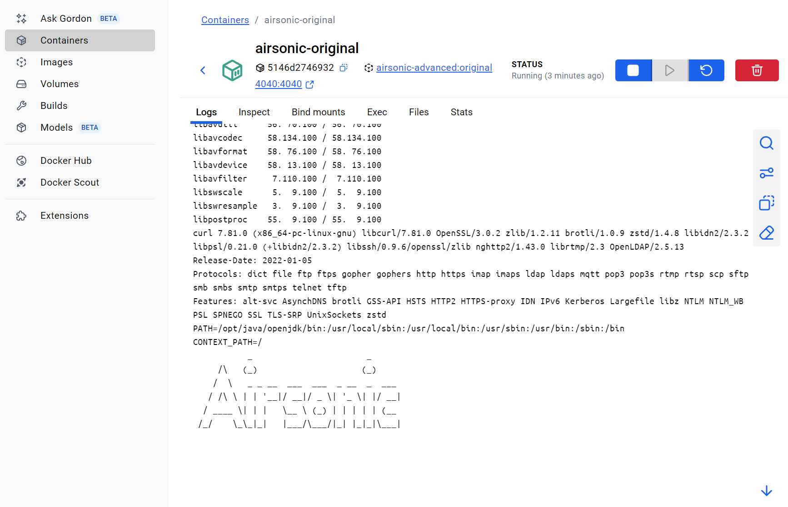

# How to Run

1. Step into the root of this project and use java-11 to build the project
    ```pwsh
    mvn -DskipTests "-Dcheckstyle.skip=true" clean package
    ```
    
2. Copy the war package to the docker folder
   ```pwsh
   cp airsonic-main/target/airsonic.war install/docker/airsonic.war
   ```
   
3. Step into the Dockerfile folder and build the image, make sure your docker is running
   ```pwsh
   cd install/docker && docker build -t airsonic-advanced:original . 
   ```
   
4. run the docker image
   ```pwsh
   docker run -d --name airsonic-original  -p 4040:4040 -v .\music:/var/music -v .\airsonic:/var/airsonic  airsonic-advanced:original
   ```
   
5. you can see the log in the [airsonic.log](/install/docker/airsonic/) file, and there should be no app log in the docker desktop's console page.
   For example, the Docker Desktop console should look something like this:
   
